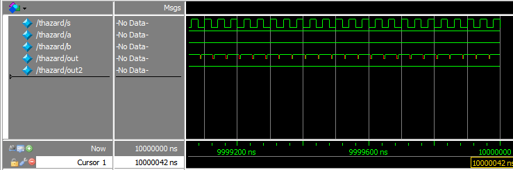
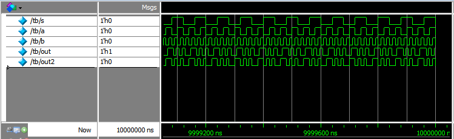
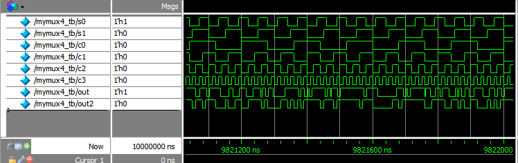
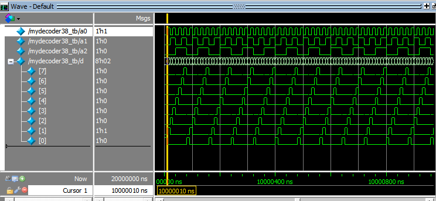

#第一次实验报告
无58 吴昆 2015010625
##第一题多路选择器
###1. 二选一多路选择器分析
插入图片
###2. 二选一多路选择器代码
mux2.v里定义了带延时mymux2和不带延时mymux2_nd的二选一多路选择器模块。  
mux2_testbench.v是测试代码，测试(s,a,b)各种组合下的输出是否和逻辑表达式y=~s*a+s*b一致，采用`always @(*)`在输入变化时立即和无延时模组的输出进行比较，如果错误输出wrong。
```verilog
`timescale 1ns/1ns;
module mymux2(out,s,a,b);
	input a,b,s;
	output out;
	not #3 (s_n,s);
	and #3 (sb,s,b);
	and #3 (sna,s_n,a);
	and #5 (ab,a,b);
	or #3 (out,sb,sna,ab);
endmodule

module mymux2_nd(out,s,a,b);
	input a,b,s;
	output out;
	not (s_n,s);
	and (sb,s,b);
	and (sna,s_n,a);
	and (ab,a,b);
	or (out,sb,sna,ab);
endmodule
```
mux2_testbench.v
```verilog
include mux2.v;
`timescale 1 ns / 1 ns
module thazard;
	reg s,a,b;
	mymux2 mx2(.out(out),.s(s),.a(a),.b(b));
	mymux2_nd mx2_nd(.out(out2),.s(s),.a(a),.b(b));
	initial begin
		s<=0;
		a<=1;
		b<=1;
	end
	initial begin
		forever #20 s<=~s;
	end
	always @(*) begin
		if(out2!=(~s)*a+s*b)
			$display("wrong");
		//else $display("right");
	end
endmodule

module tb;
	reg s,a,b;
	mymux2 mx2(.out(out),.s(s),.a(a),.b(b));
	mymux2_nd mx2_nd(.out(out2),.s(s),.a(a),.b(b));
	initial begin
		s<=0;
		a<=0;
		b<=0;
	end
	initial fork
		forever #40 s<=~s;
		forever #20 a<=~a;
		forever #10 b<=~b;
	join
	always @(*) begin
		if(out2!=(~s)*a+s*b)
			$display("wrong");
		//else $display("right");
	end
endmodule
```

###3. 竞争冒险消除
分析中提到，不加入ab项时在(s,a,b)=(0,1,1)和(s,a,b)=(1,1,1)间转换会产生毛刺，如下图所示，红色表示输出不确定。竞争冒险现象仅在模块中逻辑门有延时时会发生。

加入ab项后我们再看，毛刺已经消除。


###4. 逻辑真值测试

运行`Run 100`并没有输出wrong，由上述知逻辑输出是正确的，同时延时模块输出out和无延时模块输出out2波形一致，在时间上有延迟，因此模块逻辑是符合给出的逻辑表达式的。

###5. 四选一多路选择器的设计
四选一多路选择器可以由三个二选一多路选择器实现，按照题目给出的要求，设计如图
==插入图片==

###6. 四选一多路选择器代码
mux.v里分别定义了四选一多路选择器mymux4模块和测试代码，和上述类似，定义了无延时模块mymux4_nd将其输出与逻辑表达式`(~s0)*(~s1)*c0+s0*(~s1)*c1+(~s0)*s1*c2+s0*s1*c3`进行比较
```verilog
include mux2.v;
module mymux4(out,s0,s1,c0,c1,c2,c3);
	output out;
	input s0,s1,c0,c1,c2,c3;
	mymux2 mx2_0(.out(o0),.s(s0),.a(c0),.b(c1));
	mymux2 mx2_1(.out(o1),.s(s0),.a(c2),.b(c3));
	mymux2 mx2_2(.out(out),.s(s1),.a(o0),.b(o1));
endmodule

module mymux4_nd(out,s0,s1,c0,c1,c2,c3);
	output out;
	input s0,s1,c0,c1,c2,c3;
	mymux2_nd mx2_0(.out(o0),.s(s0),.a(c0),.b(c1));
	mymux2_nd mx2_1(.out(o1),.s(s0),.a(c2),.b(c3));
	mymux2_nd mx2_2(.out(out),.s(s1),.a(o0),.b(o1));
endmodule

module mymux4_tb;
	reg s0,s1,c0,c1,c2,c3;
	mymux4 mx4(out,s0,s1,c0,c1,c2,c3);
	mymux4_nd mx4_nd(out2,s0,s1,c0,c1,c2,c3);
	initial begin
		s0<=0;
		s1<=0;
		c0<=0;
		c1<=0;
		c2<=0;
		c3<=0;
	end
	initial fork
		forever #50 s1<=~s1;
		forever #30 s0<=~s0;
		forever #80 c0<=~c0;
		forever #40 c1<=~c1;
		forever #20 c2<=~c2;
		forever #10 c3<=~c3;
	join
	always @(*) begin
		if(out2!=(~s0)*(~s1)*c0+s0*(~s1)*c1+(~s0)*s1*c2+s0*s1*c3)
			$display("wrong");
		//else $display("right");
	end
endmodule
```
###7. 四选一多路选择器测试
执行`Run 100`，波形如图，没有输出wrong。说明结果正确。


##第二题三八译码器
###代码
decoder.v包含了三八译码器mydecoder38模块定义和测试代码。
decoder.v
```verilog
module mydecoder38(d,a2,a1,a0);
	output [7:0] d;
	input a2,a1,a0;
	not(a2_n,a2);
	not(a1_n,a1);
	not(a0_n,a0);
	and(d[7],a2,a1,a0);
	and(d[6],a2,a1,a0_n);
	and(d[5],a2,a1_n,a0);
	and(d[4],a2,a1_n,a0_n);
	and(d[3],a2_n,a1,a0);
	and(d[2],a2_n,a1,a0_n);
	and(d[1],a2_n,a1_n,a0);
	and(d[0],a2_n,a1_n,a0_n);
endmodule

module mydecoder38_tb;
	reg a0,a1,a2;
	wire [7:0] d;
	mydecoder38 dcder38(.d(d),.a2(a2),.a1(a1),.a0(a0));
	initial begin
		a0<=0;
		a1<=0;
		a2<=0;
	end
	initial fork
		forever #10 a0<=~a0;
		forever #20 a1<=~a1;
		forever #40 a2<=~a2;
	join
endmodule
```
###测试结果

