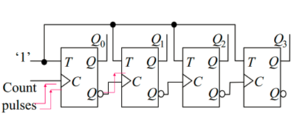
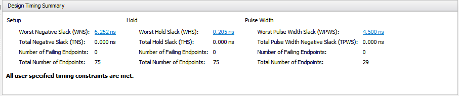

<h1 align = "center">实验一计数器设计实验报告</h1>
<h5 align = "center">无58 吴昆 2015010625</h5>

## 实验目的：
1. 掌握简单时序逻辑电路的设计方法
2. 理解同步计数器和异步计数器的设计方法
3. 了解任意进制计数器的设计方法

## 设计
使用四个触发器存储计数，每进入一个计数脉冲，计数脉冲上升沿时触发器状态开始发生改变，具体因同步或异步而异，使得触发器的存储数值（加法器）加一（减法器减一），将触发器存储的数值用译码器输出到LED管脚来显示相应的数字。
### 同步和异步的区别
同步和异步的区别在于触发器触发翻转的时机是否一致。异步加法器计数控制信号在各级间逐级传递，不同级存在延时，计数器位数越多反传到稳定状态的时间越长；而同步加法器则将输入脉冲连到各触发器的时钟，当触发脉冲上升沿来临，所有的触发器同时发生翻转，其翻转稳定时间仅仅取决于单级触发器的翻转时间，而与计数器的位数无关。
### 异步加法器
异步加法器的第一级触发器时钟连在计数输入信号上，其后各级的时钟都连在前一级的反相输出上。当进入一个计数脉冲，第一级状态先发生改变，随后依次传递直至最后一级。各级从1变为0时将时钟上升沿传到下一级触发器。当Reset高电平时所有位状态置0。
设计电路如图所示：  

### 同步加法器
依然是计数脉冲改变触发器状态，将触发器输出接入译码器输出LED电平。  
同步器中各级触发器使用同一时钟信号，因而速度较快，这里就是计数脉冲。每一位在时钟上升沿到来时判断前面各级（状态值低位）是否均为1，如果是则跳变。  
下图是一种可能的实现方式，但由于进行行为级建模，只需关注电路的行为特征，不需要关注具体的电路实现。  

### 同步减法器
与同步加法器类似，区别在于在计数脉冲上升沿状态开始改变，改变完成状态值减一。


## 代码
### 译码器
在例程bcd7.v上进行修改，首先加入了A~F的对应LED输出，其次全部取反这样调用的时候就不用对模块的输出取反给LED输出了。  
bcd7.v
```verilog
`timescale 1ns/1ns
module BCD7(din,dout);
input [3:0] din;
output [6:0] dout;

assign dout=(din==0)?~7'b111_1110:
            (din==1)?~7'b011_0000:
            (din==2)?~7'b110_1101:
            (din==3)?~7'b111_1001:
            (din==4)?~7'b011_0011:
            (din==5)?~7'b101_1011:
            (din==6)?~7'b101_1111:
            (din==7)?~7'b111_0000:
            (din==8)?~7'b111_1111:
            (din==9)?~7'b111_1011:
            (din==10)?~7'b111_0111:
            (din==11)?~7'b001_1111:
            (din==12)?~7'b100_1110:
            (din==13)?~7'b011_1101:
            (din==14)?~7'b100_1111:
            (din==15)?~7'b100_0111:7'b0;

endmodule
```
### 管脚约束
参照demo的管脚约束，将按钮的
constraint.xdc
```
set_property PACKAGE_PIN V17 [get_ports {reset}]
set_property PACKAGE_PIN U17 [get_ports {but_input}]
#CA->CG
set_property PACKAGE_PIN W7 [get_ports {leds[0]}]
set_property PACKAGE_PIN W6 [get_ports {leds[1]}]
set_property PACKAGE_PIN U8 [get_ports {leds[2]}]
set_property PACKAGE_PIN V8 [get_ports {leds[3]}]
set_property PACKAGE_PIN U5 [get_ports {leds[4]}]
set_property PACKAGE_PIN V5 [get_ports {leds[5]}]
set_property PACKAGE_PIN U7 [get_ports {leds[6]}]
set_property PACKAGE_PIN W5 [get_ports clk]

create_clock -period 10.000 -name CLK -waveform {0.000 5.000} [get_ports clk]
set_property CLOCK_DEDICATED_ROUTE FALSE [get_nets but_input_IBUF]

set_property IOSTANDARD LVCMOS33 [get_ports {but_input}]
set_property IOSTANDARD LVCMOS33 [get_ports {clk}]
set_property IOSTANDARD LVCMOS33 [get_ports {reset}]
set_property IOSTANDARD LVCMOS33 [get_ports {leds[6]}]
set_property IOSTANDARD LVCMOS33 [get_ports {leds[5]}]
set_property IOSTANDARD LVCMOS33 [get_ports {leds[4]}]
set_property IOSTANDARD LVCMOS33 [get_ports {leds[3]}]
set_property IOSTANDARD LVCMOS33 [get_ports {leds[2]}]
set_property IOSTANDARD LVCMOS33 [get_ports {leds[1]}]
set_property IOSTANDARD LVCMOS33 [get_ports {leds[0]}]
```
### 异步复位的同步加法器
写法非常简单，使用always块，在计数脉冲上升沿，将触发器状态值s[3:0]加上1即可，这等效于计数脉冲连接到四个触发器的时钟。我们发现在行为级编程中，只要关注电路的期望行为特点，在这里就是计数脉冲上升沿状态值加一，就行了；而不用关注具体的实现，后者可能比较复杂，就如设计电路所示，但这些Vivado都会帮我们做好。  
为了实现异步复位，把`reset`信号上升沿也放到always块的触发条件中，再在always块中判断触发条件进行相应的变化，也就是说电路的触发有时钟和复位两种。
adder_sync.v
```verilog
module top_adder_sync (leds,but_input,clk,reset);
output [0:6] leds;
input but_input,clk,reset;
reg [3:0] s;
wire [0:6] leds;
debounce xdb(.clk(clk),.key_i(but_input),.key_o(but_input_dbs));
initial begin
s<=4'b0000;
end
always @(posedge but_input_dbs or posedge reset)
begin 
	if (reset)
	s<=4'b0000;
	else
	s[3:0]<=s[3:0]+1; 
end
BCD7 bcd27seg (.din(s),.dout(leds));
endmodule
```
### 异步复位的异步加法器
同样使用always块，但s不同的位，即不同的触发器状态值是在各自的always块中进行改变，条件是上一级（低1位）由1反转至0的下降沿。那么这就是说上一级的反相输出是下一级的时钟信号，但我们不需要关注这些电路细节。  
为了实现异步复位，把`reset`信号上升沿也放到always块的触发条件中，再在always块中判断触发条件进行相应的变化，也就是说电路的触发有计数脉冲（第一级）、上一级反相输出（除了第一级以外的触发器）和复位三种。
adder_async.v
```verilog
module top_adder_async (leds,but_input,clk,reset);
output [0:6] leds;
input but_input,clk,reset;
reg [3:0] s;
wire [0:6] leds;
initial begin
s<=4'b0000;
end
debounce xdb(.clk(clk),.key_i(but_input),.key_o(but_input_dbs));
always @(posedge but_input_dbs or posedge reset)
    if(reset)
        s[0]<=0;
    else
	s[0]<=~s[0]; 
always @(negedge s[0] or posedge reset)
       if(reset)
           s[1]<=0;
       else
	s[1]<=~s[1];
always @(negedge s[1] or posedge reset)
       if(reset)
           s[2]<=0;
       else
	s[2]<=~s[2];
always @(negedge s[2] or posedge reset)
       if(reset)
           s[3]<=0;
       else
	s[3]<=~s[3];
BCD7 bcd27seg (s,leds);
endmodule
```

### 异步复位的同步减法器
在异步复位的同步加法器上把输入上升沿时`s<=s+1`改成`s<=s-1`即可。
minus_sync.v
```verilog
module top_minus_sync (leds,but_input,clk,reset);
output [0:6] leds;
input but_input,clk,reset;
reg [3:0] s;
wire [0:6] leds;
initial begin
s<=4'b0000;
end
debounce xdbs(.clk(clk),.key_i(but_input),.key_o(but_input_dbs));
always @(posedge but_input_dbs or posedge reset)
begin
	//if (but_input) 
	if (reset)
	s<=4'b0000;
	else
	s[3:0]<=s[3:0]-1; 
end
BCD7 bcd27seg (.din(s),.dout(leds));
endmodule
```
## 仿真代码与结果
### 仿真代码
在Modelsim里仿真时，将加法器、减法器里的防抖动模块去掉。本质上三个代码都是一样的，不断地改变计数脉冲电平，在910ns时改变`reset`为高电平，930ns改回低电平。测试代码分别如下：
adder_sync_tb.v
```verilog
`timescale 1ns/1ns
module adder_sync_tb;
reg clk,reset,clk_input;
top_adder_sync tas(leds,clk_input,clk,reset);
initial begin
clk<=0;
reset<=0;
clk_input<=1;
end
initial fork
forever #50clk_input<=~clk_input;
forever #5 clk<=~clk;
#910 reset<=1;
#930 reset<=0;
//#100clk_input<=~clk_input;
join
endmodule
```

adder_async_tb.v
```verilog
`timescale 1ns/1ns
module adder_async_tb;
reg clk,reset,but_input;
wire [6:0] leds;
top_adder_async tas(leds,but_input,clk,reset);
initial begin
clk<=0;
reset<=0;
but_input<=1;
end
initial fork
forever #50 but_input<=~but_input;
forever #5 clk<=~clk;
#910 reset<=1;
#930 reset<=0;
//#100clk_input<=~clk_input;
join
endmodule
```

minus_sync_tb.v
```verilog
`timescale 1ns/1ns
module adder_sync_tb;
reg clk,reset,clk_input;
top_minus_sync tas(leds,clk_input,clk,reset);
initial begin
clk<=0;
reset<=0;
clk_input<=1;
end
initial fork
forever #50clk_input<=~clk_input;
forever #5 clk<=~clk;
#910 reset<=1;
#930 reset<=0;
//#100clk_input<=~clk_input;
join
endmodule
```

## 综合结果
### 同步加法器
  

### 异步加法器
  

### 同步减法器
  

## 仿真结果
同步加法器仿真结果如下：  
  
异步加法器仿真结果如下：  
  
两幅图中第五行`leds`为输出到LED管脚信号，第四行`s`为加法器中触发器状态，第三行`but_input`为输入信号，可以看到在输入信号上升沿触发器代表数值加一，正确实现了加法器的电路功能。在复位信号`reset`上升沿，触发器状态值置零；在`reset`为高电平时，触发器状态值始终为0。符合要求。  
同步减法器仅修改同步加法器中输入上升沿时`s<=s+1`改成`s<=s-1`，如果同步加法器功能正确那么减法器理应同样正确，仿真结果如下：


### 硬件调试情况
整体测试良好，符合设计要求；发现不加防抖动代码一般不会出现按钮按下松开跳了多次的现象，但为了鲁棒性还是增加了，但这样的话在较短的两次或多次输入中第二次及之后的输入会被忽略。  
在此前的硬件调试中，发现了重驱动和触发器高低位index搞反的情况（从高到低应该是s[3]至s[0]），前者导致LED点平输出为常数，在合成器中亦有warning报警；后者导致输出不是逐个加一。


### 实验结论
1. 通过实验，实现了同步、异步加法器和减法器，对于同步、异步概念有了更深的理解，第一次在FPGA上实现电路功能，更熟练地运用工具：Vivado综合、Modelsim仿真。
2. 刚开始写verilog时，犯了重驱动的错误，也就是同一个变量在两个always块中发生改变。尽管这在verilog中合乎语法Modelsim也仿真正常，但在FPGA上就会出现按键没有反应的错误。本质原因是这样实现的电路同一个模块由多个输入进行了驱动，这样的结果是不可预料的。我们在实现verilog的时候一定要心中有数对应的硬件，而不能在脱离硬件来写代码。
3. 行为级编程只需关注电路的行为特点，而不用关注电路具体实现的细节，这简化了我们的设计工作量，在异步复位的同步加法器中尤其明显。
4. 我们发现防抖动代码在两次按键间隔较短时会忽略第二次的信号，有一些“矫枉过正”。