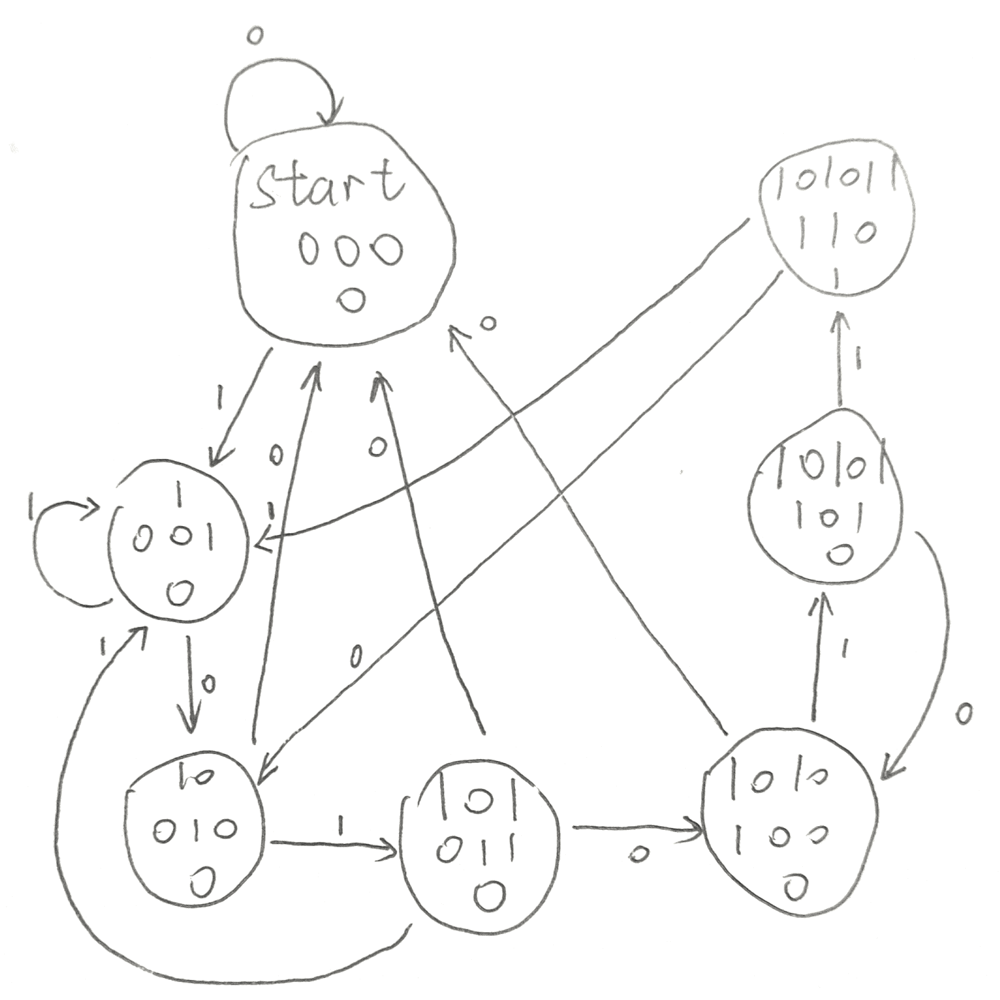
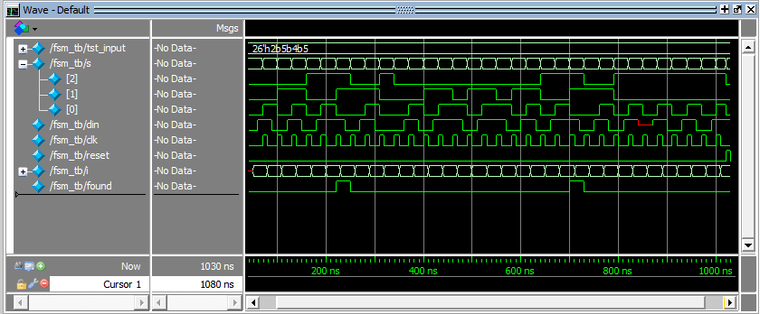
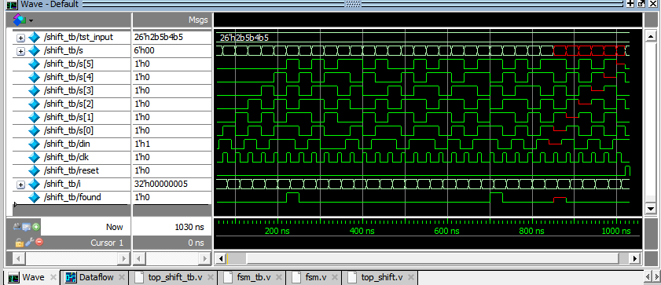
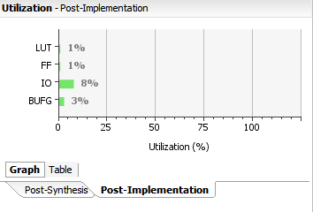
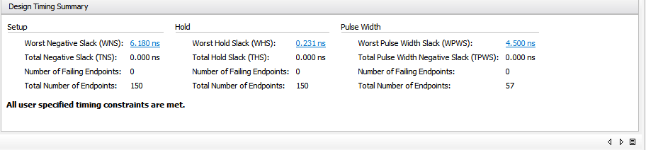
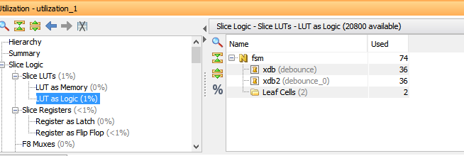
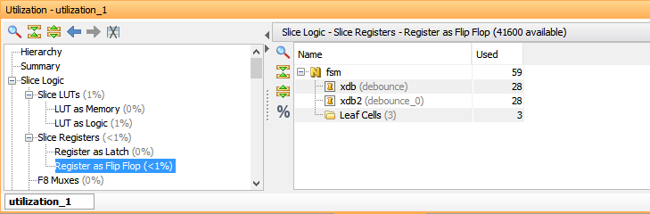
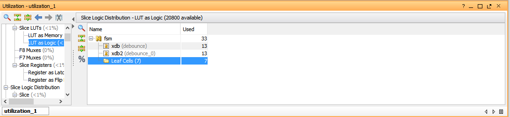
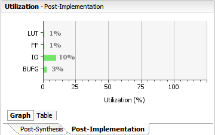
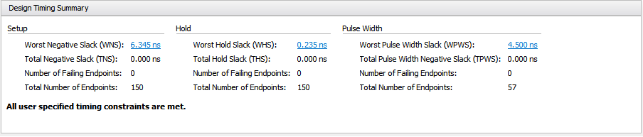

<h1 align = "center">实验二. 序列检测器设计实验报告</h1>
<h5 align = "center">无58 吴昆 2015010625</h5>

## 一、实验目的：
1. 掌握有限状态机的实现原理和方法
2. 掌握序列检测的方法

## 二、设计：
### 1. 实验任务
1. 用有限状态机设计序列检测器，检测序列为“101011”。
2. 用移位寄存器和组合逻辑实现序列检测器，检测序列“101011”。
3. 要求：按键去抖，状态机要求最简。

### 2. 有限状态机设计
状态转移图如下图所示，每个状态的圆圈中第一行是状态值（或状态名），第二行是状态的编码，和led灯亮对应，第三行是对应的输出。状态值表示的是目前输入序列和检测序列的匹配的部分，如果当前位依然匹配那么进展到下一个状态，直至全部匹配到达“101011”状态，这个状态会输出1；而其他状态输出均为0。  
需要注意的是，在“10101”状态，输入0失配会到“1010”状态，这是因为后四位（后缀）与检测序列匹配。“101”状态输入1，和“101011”状态输入1和输入0情况类似，详见状态转移图。  
这个图中没有画上reset输入，当reset下降沿进入系统时，状态重置到“start”初始状态。  


### 3. 移位器设计
使用一个6bit的移位寄存器存储后六位输入，当且仅当其为"101011"时输出为1。

## 三、代码
### 1. 代码说明
使用`found`来表示序列检测器的输出，当且仅当后六位为"101011"时`found`输出1，对应LED灯亮。  
此外，还有一些表示内部状态的LED灯，对应变量`s`。在基于有限状态机的设计中，有7个（有用的）内部状态，对应三位的`s`及三个LED灯；在基于移位寄存器的实现中`s`为6位。  
`found`和`s`存在关系，在基于有限状态机中当且仅当`s==3'b110`，在基于移位寄存器中当且仅当`s==6'b101011`有`found==1`；使用assign对`found`赋值，亦即综合器对`s`输出使用组合电路来输出`found`。  
`din`为输入，`clk_i`和`reset_i`分别为手动时钟输入和复位输入；`system_clk`为FPGA内部时钟。  
### 2. 基于有限状态机的序列检测器
constraint_fsm.xdc  
```
set_property IOSTANDARD LVCMOS33 [get_ports found]
set_property IOSTANDARD LVCMOS33 [get_ports system_clk]
set_property IOSTANDARD LVCMOS33 [get_ports clk_i]
set_property IOSTANDARD LVCMOS33 [get_ports reset_i]
set_property IOSTANDARD LVCMOS33 [get_ports din]
set_property IOSTANDARD LVCMOS33 [get_ports {s[0]}]
set_property IOSTANDARD LVCMOS33 [get_ports {s[1]}]
set_property IOSTANDARD LVCMOS33 [get_ports {s[2]}]

set_property PACKAGE_PIN U16 [get_ports found]
set_property PACKAGE_PIN W5 [get_ports system_clk]
set_property PACKAGE_PIN U17 [get_ports clk_i]
set_property PACKAGE_PIN T18 [get_ports reset_i]
set_property PACKAGE_PIN V16 [get_ports din]
set_property PACKAGE_PIN U15 [get_ports {s[0]}]
set_property PACKAGE_PIN U14 [get_ports {s[1]}]
set_property PACKAGE_PIN V14 [get_ports {s[2]}]

create_clock -period 10.000 -name CLK -waveform {0.000 5.000} [get_ports system_clk]
```

fsm.v  
```verilog
module fsm(found,s,clk_i,din,reset_i,system_clk);
input din,clk_i,reset_i,system_clk;
output reg [2:0] s;
output found;
//debounce xdb(.clk(system_clk),.key_i(reset_i),.key_o(reset));
debounce xdb2(.clk(system_clk),.key_i(clk_i),.key_o(clk));
initial begin
s<=3'b000;
end
always @(posedge clk or posedge reset_i)
begin
if (reset_i)
	begin
	s<=3'b000;
	end
else if(din)
	begin
	case(s)
	3'b000:s<=3'b001;
	3'b001:s<=3'b001;
	3'b010:s<=3'b011;
	3'b011:s<=3'b001;
	3'b100:s<=3'b101;
	3'b101:s<=3'b110;
	3'b110:s<=3'b001;
	3'b111:s<=3'b000;
	endcase
	end
else
	begin
	case(s)
	3'b000:s<=3'b000;
	3'b001:s<=3'b010;
	3'b010:s<=3'b000;
	3'b011:s<=3'b100;
	3'b100:s<=3'b000;
	3'b101:s<=3'b100;
	3'b110:s<=3'b010;
	3'b111:s<=3'b000;
	endcase
	end
end
assign found=(s==3'b110)?1:0;
endmodule
```
由于这样的写法导致vivado没有识别出有限状态机，我们根据风格手册进行了重写，分析详见综合分析：
fsm_new.v
```verilog
module fsm(found,s,clk_i,din,reset_i,system_clk);
input din,clk_i,reset_i,system_clk;
output reg [2:0] s;
output found;
debounce xdb(.clk(system_clk),.key_i(reset_i),.key_o(reset));
debounce xdb2(.clk(system_clk),.key_i(clk_i),.key_o(clk));
initial begin
s<=3'b000;
end
always @(posedge clk or posedge reset)
begin
if (reset)
	begin
	s<=3'b000;
	end
else
	begin
	case(s)
	3'b000: if(din)
	           s<=3'b001;
	        else
	           s<=3'b000;
	3'b001: if(din)
	           s<=3'b001;
	        else
	           s<=3'b010;
	3'b010: if(din)
	           s<=3'b011;
	        else
	           s<=3'b000;
	3'b011: if(din)
	           s<=3'b001;
	        else
	           s<=3'b100;
	3'b100: if(din)
	           s<=3'b101;
	        else
	           s<=3'b000;
	3'b101: if(din)
	           s<=3'b110;
	        else
	           s<=3'b100;
	3'b110: if(din)
	           s<=3'b001;
	        else
	           s<=3'b010;
	3'b111: if(din)
	           s<=3'b000;
	        else
	           s<=3'b000;
	endcase
	end
end
assign found=(s==3'b110)?1:0;

endmodule
```

### 3. 基于移位寄存器的序列检测器
constraint_shift.xdc  
```
set_property PACKAGE_PIN T18 [get_ports {reset_i}]
set_property PACKAGE_PIN V16 [get_ports {din}]
set_property PACKAGE_PIN U17 [get_ports {clk_i}]
set_property PACKAGE_PIN U16 [get_ports {found}]
set_property PACKAGE_PIN E19 [get_ports {s[0]}]
set_property PACKAGE_PIN U19 [get_ports {s[1]}]
set_property PACKAGE_PIN V19 [get_ports {s[2]}]
set_property PACKAGE_PIN W18 [get_ports {s[3]}]
set_property PACKAGE_PIN U15 [get_ports {s[4]}]
set_property PACKAGE_PIN U14 [get_ports {s[5]}]
set_property PACKAGE_PIN V14 [get_ports {s[6]}]
set_property PACKAGE_PIN W5 [get_ports {system_clk}]

create_clock -period 10.000 -name CLK -waveform {0.000 5.000} [get_ports system_clk]

set_property IOSTANDARD LVCMOS33 [get_ports {din}]
set_property IOSTANDARD LVCMOS33 [get_ports {found}]
set_property IOSTANDARD LVCMOS33 [get_ports {clk_i}]
set_property IOSTANDARD LVCMOS33 [get_ports {system_clk}]
set_property IOSTANDARD LVCMOS33 [get_ports {reset_i}]
set_property IOSTANDARD LVCMOS33 [get_ports {s[0]}]
set_property IOSTANDARD LVCMOS33 [get_ports {s[1]}]
set_property IOSTANDARD LVCMOS33 [get_ports {s[2]}]
set_property IOSTANDARD LVCMOS33 [get_ports {s[3]}]
set_property IOSTANDARD LVCMOS33 [get_ports {s[4]}]
set_property IOSTANDARD LVCMOS33 [get_ports {s[5]}]
set_property IOSTANDARD LVCMOS33 [get_ports {s[6]}]
```

top_shift.c  
```verilog
module top_shift(found,s,clk_i,reset_i,din,system_clk);
output found;
output reg [5:0] s;
input clk_i,reset_i,din,system_clk;
debounce xdb(.clk(system_clk),.key_i(clk_i),.key_o(clk));
debounce xdb2(.clk(system_clk),.key_i(reset_i),.key_o(reset));
initial begin
s<=6'b000000;
end
always @(posedge clk or posedge reset)
begin
if (reset)
	s<=6'b000000;
else
begin
	s[5]<=s[4];
	s[4]<=s[3];
	s[3]<=s[2];
	s[2]<=s[1];
	s[1]<=s[0];
	s[0]<=din;
end
end
assign found=(s==6'b101011)?1:0;

endmodule
```

## 四、仿真结果与分析
### 1. 测试方法
分别测试在给定序列下内部状态（LED灯显示）和序列检测输出的正确性，使用一个比特串`110101101011011010010110101`，其中有两次序列检测到应输出1。  
对于基于有限状态机的实现，在失配时内部状态`s`不应该跳到0而是根据状态转移图根据最大匹配后缀跳到相应的状态。以此构造了上述比特串并进行测试。  
测试时复制了相应模块代码并去除了防抖模块。

### 2. 代码
fsm_tb.v  
```verilog
module fsm_test(found,s,clk_i,din,reset_i);
input din,clk_i,reset_i;
output reg [2:0] s;
output found;
initial begin
s<=3'b000;
end
always @(posedge clk_i or posedge reset_i)
begin
if (reset_i)
	begin
	s<=3'b000;
	end
else if(din)
	begin
	case(s)
	3'b000:s<=3'b001;
	3'b001:s<=3'b001;
	3'b010:s<=3'b011;
	3'b011:s<=3'b001;
	3'b100:s<=3'b101;
	3'b101:s<=3'b110;
	3'b110:s<=3'b001;
	3'b111:s<=3'b000;
	endcase
	end
else
	begin
	case(s)
	3'b000:s<=3'b000;
	3'b001:s<=3'b010;
	3'b010:s<=3'b000;
	3'b011:s<=3'b100;
	3'b100:s<=3'b000;
	3'b101:s<=3'b100;
	3'b110:s<=3'b010;
	3'b111:s<=3'b000;
	endcase
	end
end
assign found=(s==3'b110)?1:0;
endmodule

module fsm_tb;
reg [25:0] tst_input=27'b110101101011011010010110101;
wire [2:0] s;
reg din,clk,reset;
integer i;
fsm_test fsm_tst(.found(found),.s(s),.din(din),.reset_i(reset),.clk_i(clk));
initial begin
reset=0;
din=0;
clk=0;
#50
for(i=0;i<27;i=i+1)
	begin
	#10 din=tst_input[i];
	#10 clk=1;
	#10 clk=0;
	end
for(i=0;i<5;i=i+1)
	begin
	#10 din=tst_input[i];
	#10 clk=1;
	#10 clk=0;
	end
#10 reset=1;
#10 reset=0;
end
endmodule
```

top_shift_tb.v  
```verilog
module top_shift_test(found,s,clk_i,reset_i,din);
output found;
output reg [5:0] s;
input clk_i,reset_i,din;
initial begin
s<=6'b000000;
end
always @(posedge clk_i or posedge reset_i)
begin
if (reset_i)
	s<=6'b000000;
else
begin
	s[5]<=s[4];
	s[4]<=s[3];
	s[3]<=s[2];
	s[2]<=s[1];
	s[1]<=s[0];
	s[0]<=din;
end
end
assign found=(s==6'b101011)?1:0;
endmodule

module shift_tb;
reg [25:0] tst_input=27'b110101101011011010010110101;
wire [5:0] s;
reg din,clk,reset;
integer i;
top_shift_test top_shift_test(.found(found),.s(s),.din(din),.reset_i(reset),.clk_i(clk));
initial begin
reset=0;
din=0;
clk=0;
#50
for(i=0;i<27;i=i+1)
	begin
	#10 din=tst_input[i];
	#10 clk=1;
	#10 clk=0;
	end
for(i=0;i<5;i=i+1)
	begin
	#10 din=tst_input[i];
	#10 clk=1;
	#10 clk=0;
	end
#10 reset=1;
#10 reset=0;
end
endmodule
```

### 3. 仿真波形
仿真波形分别如下所示，可以发现，序列检测输出的正确性得到满足，同时基于有限状态机的内部状态转移也正确。   
基于有限状态机如下：  
  
基于移位寄存器如下：  
  

## 五、时序综合情况
### 1. 基于有限状态机
  



这种实现方法消耗的LUT和寄存器很多，并且也没有识别出来是fsm并进行优化，说明写的风格存在问题：
  
  
我们根据Xilinx风格手册重写了fsm，见代码，发现这样以后使用的LUT减少了很多，但寄存器依然使用了59个，同时在Synthesis Report中发现成功识别有限状态机（下图二）：  
  

### 2. 基于移位寄存器
  



## 六、实验结论
1. 通过这个实验，进一步巩固了对于有限状态机和移位寄存器的认识。巩固使用verilog语言中的`case`,`assign`。尤其是领悟了`assign`的电路意义，其对应的是从输入组合逻辑得到输出信号电路，是时延比较小的组合电路，在两种实现中表现为内部状态`s`的代码为设计锁存器的连接和锁存器的输出间的组合电路，而对`found`的`assign`则表现为从锁存器的输出到序列检测器结果输出的组合电路。
2. 在这个实验中，debug比较久的有两个问题。首先使用了复位`reset`下降沿触发`always`块，低电平复位，和clk上升沿触发`s`改变的`always`块相同，因此会出现`clk`上升沿`reset`低电平复位导致按钮没有反应的现象。如果我们把`reset`触发复位新写一个`always`块也不行，因为这导致在两个`always`块里修改`s`导致重驱动。  
第二个bug是`sw1`对应的是从右往左的第二个开关，我把它当成第一个了，但是开关的编号是从`sw0`开始的。:-(
3. 硬件描述语言是编程语言，又是硬件的描述，因此平时写时就要养成良好的习惯，多参考对应FPGA公司的风格手册，比如说这次实验中的有限状态机就是要根据官方风格手册进行编码，这样才能被Vivado正确识别并被对应优化。