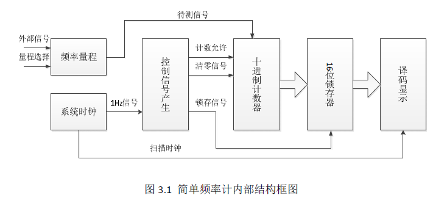
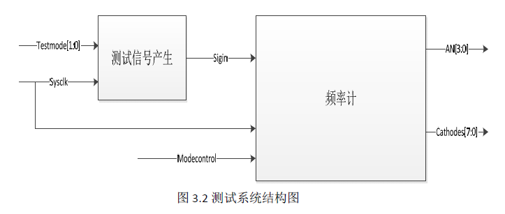
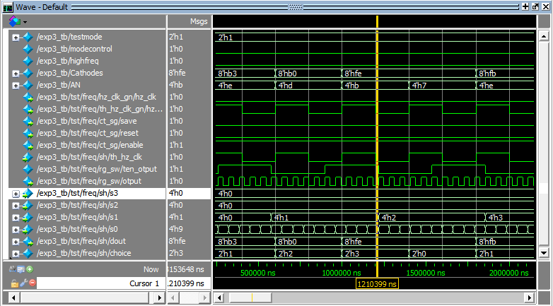
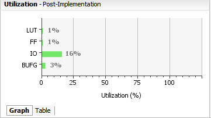
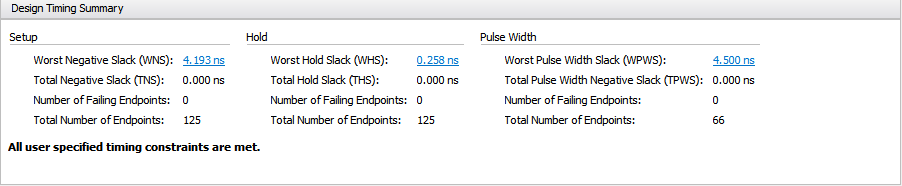
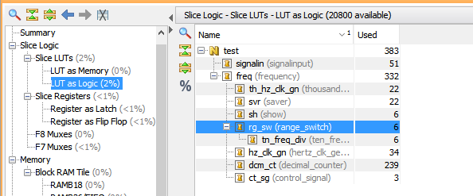
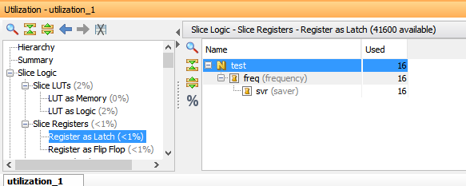
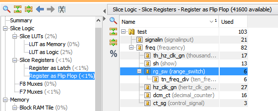

<h1 align = "center">实验三. 频率计设计实验报告</h1>
<h5 align = "center">无58 吴昆 2015010625</h5>

## 一、实验目的：
1. 掌握频率计的原理和设计方法。

## 二、设计：
### 0. 管脚替换说明
要求开关SW7和LED7分别为高量程选择与指示灯，由于SW7接触不良，现替换为SW8（V2）和LED8（V13），括号内为对应管脚。
### 1. 原理
频率计内部实现框图如下所示，其内部包括频率量程处理模块（10分频）、时钟频率产
生模块、控制信号产生模块、十进制计数器模块、锁存器模块、译码显示模块等。:  
  
利用系统时钟产生1Hz的控制信号，在1s的时长内利用计数器对待测信号进行计数，将计数结果锁存（或者保存，不是指latch）并输出到数码管中显示。  
1. 其中频率量程模块负责根据设定的量程控制信号决定是否对输入信号进行10分频；  
2. 系统时钟模块根据外部输入的参考时钟产生标准1Hz的控制信号；  
3. 控制信号产生模块产生计数所需的使能、清零信号以及保存测量结果所需的锁存信号和扫描显示所需的扫描时钟信号；  
4. 十进制计数模块在计数使能、清零信号控制下对外部输入信号（或其10分频信号）在1s周期内对其进行计数操作；  
6. 锁存器模块在计数完成之后对计数结果进行锁存，保存上一测量周期的测量结果；  
7. 译码显示模块将测量结果输出到LED数码管显示，采用扫描的方式实现多位数据的同时显示。  

### 2. 各部件说明
根据实验指导书，如下按模块分别说明：
1. 频率量程处理。使用开关（SW7）来控制量程。低量程直接测量周期。高量
程先对待测信号进行10分频。
2. 系统时钟模块。开发板上W5端口提供100MHz 时钟，需要根据系统时钟产
生两个信号。一个是1Hz的控制信号，用来控制计数器行为以及锁存器。另
外一个是输出到数码管的扫描信号，频率为1kHz。
3. 控制信号产生模块。利用1Hz时钟产生计数器使能信号，清零信号以及锁存
器的锁存信号。
4. 四位十进制计数器。当enable有效时对计数器的clock 信号进行十进制计数，
reset 有效时对十进制计数器进行清零。
5. 锁存器模块。Lock 信号有效时输出锁定，否则，输出透明显示计数器值。
6. 译码显示模块。数码管是4个7段数码管，分别显示千百十个位。另外使用
LED 灯（LD7）区别高低量程。

### 3. 控制信号和对应元件实现细节说明
控制信号产生模块在1Hz时钟输入上升沿取反输出`save`,`reset`,`enable`，初始时为0,0,1。  
`enable`和`reset`控制四位十进制计数器：在`enable`和`reset`分别为1和0时，将计数输入上升沿并按照十进制输出四位；在`enable`和`reset`分别是0和1时置零。  
`save`控制锁存器模块，在`save`为0时输出输入的信号，在`save`为1时所存当时的四位十进制输入信号并保持输出。  
综上所述，系统表现出来的行为是在奇数1Hz时钟周期内计数输入信号上升沿并不断改变输出（到译码器到数字管）；在偶数秒保持数字管上的显示，同时计数器内部清零；以此循环。

### 4.测试方法
测试方法：为了测试方便，在实验指导书的最后提供一个待测信号输入模块signalinput(testmode[1:0],sysclk,sigin)，其中testmode[1:0]接到SW1~SW0 的开关输入，00,01,10,11 分别选择4 个不同频率的信号。sysclk 是开发板提供的100MHz 时钟，sigin 是输出的待测信号。要求同学按照下图所示对测试信号输入模块以及自行设计的频率计模块进行连接：  
  
## 三、代码
### 1. 管脚约束
constraint.xdc
```
set_property IOSTANDARD LVCMOS33 [get_ports sysclk]
set_property IOSTANDARD LVCMOS33 [get_ports {testmode[0]}]
set_property IOSTANDARD LVCMOS33 [get_ports {testmode[1]}]
set_property IOSTANDARD LVCMOS33 [get_ports {AN[0]}]
set_property IOSTANDARD LVCMOS33 [get_ports {AN[1]}]
set_property IOSTANDARD LVCMOS33 [get_ports {AN[2]}]
set_property IOSTANDARD LVCMOS33 [get_ports {AN[3]}]
set_property IOSTANDARD LVCMOS33 [get_ports {Cathodes[0]}]
set_property IOSTANDARD LVCMOS33 [get_ports {Cathodes[1]}]
set_property IOSTANDARD LVCMOS33 [get_ports {Cathodes[2]}]
set_property IOSTANDARD LVCMOS33 [get_ports {Cathodes[3]}]
set_property IOSTANDARD LVCMOS33 [get_ports {Cathodes[4]}]
set_property IOSTANDARD LVCMOS33 [get_ports {Cathodes[5]}]
set_property IOSTANDARD LVCMOS33 [get_ports {Cathodes[6]}]
set_property IOSTANDARD LVCMOS33 [get_ports {Cathodes[7]}]
set_property IOSTANDARD LVCMOS33 [get_ports {highfreq}]
set_property IOSTANDARD LVCMOS33 [get_ports {modecontrol}]

set_property PACKAGE_PIN W5 [get_ports sysclk]
set_property PACKAGE_PIN V16 [get_ports {testmode[0]}]
set_property PACKAGE_PIN V17 [get_ports {testmode[1]}]
set_property PACKAGE_PIN U2 [get_ports {AN[0]}]
set_property PACKAGE_PIN U4 [get_ports {AN[1]}]
set_property PACKAGE_PIN V4 [get_ports {AN[2]}]
set_property PACKAGE_PIN W4 [get_ports {AN[3]}]
set_property PACKAGE_PIN W7 [get_ports {Cathodes[0]}]
set_property PACKAGE_PIN W6 [get_ports {Cathodes[1]}]
set_property PACKAGE_PIN U8 [get_ports {Cathodes[2]}]
set_property PACKAGE_PIN V8 [get_ports {Cathodes[3]}]
set_property PACKAGE_PIN U5 [get_ports {Cathodes[4]}]
set_property PACKAGE_PIN V5 [get_ports {Cathodes[5]}]
set_property PACKAGE_PIN U7 [get_ports {Cathodes[6]}]
set_property PACKAGE_PIN V7 [get_ports {Cathodes[7]}]
set_property PACKAGE_PIN V13 [get_ports {highfreq}]
set_property PACKAGE_PIN V2 [get_ports {modecontrol}]

create_clock -period 10.000 -name CLK -waveform {0.000 5.000} [get_ports sysclk]
```
### 2. 各部件代码
共一个文件，命名为control_signal.v。  

control_signal.v  
```verilog
module hertz_clk_generation(hz_clk,system_clk);
input system_clk;
output reg hz_clk;
reg [25:0] s;
initial begin
s<=1;
hz_clk<=0;
end
always @(posedge system_clk)
begin
s<=s+1;
if(s==26'd50000000)
begin
hz_clk<=~hz_clk;
s<=1;
end
end
endmodule

module thousand_hertz_clk_generation(hz_clk,system_clk);
input system_clk;
output reg hz_clk;
reg [15:0] s;
initial begin
s<=1;
hz_clk<=0;
end
always @(posedge system_clk)
begin
s<=s+1;
if(s==16'd50000)
begin
hz_clk<=~hz_clk;
s<=1;
end
end
endmodule

module ten_frequency_divider(otput,iput);
output reg otput;
input iput;
reg [4:0] s;
initial begin
s<=4'd0;
otput<=0;
end
always @(posedge iput)
begin
s<=s+1;
if (s==4'd4)
begin
s<=4'd0;
otput<=~otput;
end
end
endmodule

module range_switch(otput,iput,modecontrol);
ten_frequency_divider tn_freq_div(.otput(ten_otput),.iput(iput));
output reg otput;
input iput,modecontrol;
always @*
begin
if (modecontrol)
otput<=ten_otput;
else
otput<=iput;
end
endmodule

module control_signal(save,enable,reset,hz_clk);
input hz_clk;
output reg save,enable,reset;
initial begin
save<=0;
enable<=1;
reset<=0;
end
always @(posedge hz_clk)
begin
save<=~save;
enable<=~enable;
reset<=~reset;
end
endmodule

module decimal_counter(s3,s2,s1,s0,iput,enable,reset);
output reg [3:0] s3;
output reg [3:0] s2;
output reg [3:0] s1;
output reg [3:0] s0;
reg [15:0] s;
input iput,enable,reset;
initial begin
s<=0;
end
always @*
begin
s3[3:0]<=(s/1000)%10;
s2[3:0]<=(s/100)%10;
s1[3:0]<=(s/10)%10;
s0[3:0]<=s%10;
end
always @(posedge iput or posedge reset)
begin
if (reset)
s<=0;
else if(enable)
s<=s+1;
end
endmodule

module saver(saved_s3,saved_s2,saved_s1,saved_s0,save,s3,s2,s1,s0);
input save;
input [3:0] s3;
input [3:0] s2;
input [3:0] s1;
input [3:0] s0;
output reg [3:0] saved_s3;
output reg [3:0] saved_s2;
output reg [3:0] saved_s1;
output reg [3:0] saved_s0;
always @*
begin
if(~save)
begin
saved_s3<=s3;
saved_s2<=s2;
saved_s1<=s1;
saved_s0<=s0;
end
end
endmodule

module show(dout,an3,an2,an1,an0,th_hz_clk,s3,s2,s1,s0);
input [3:0] s3;
input [3:0] s2;
input [3:0] s1;
input [3:0] s0;
input th_hz_clk;
output reg [7:0] dout;
output reg an3,an2,an1,an0;
wire [6:0] d0;
wire [6:0] d1;
wire [6:0] d2;
wire [6:0] d3;
BCD7 bcd1(.din(s0),.dout(d0));
BCD7 bcd2(.din(s1),.dout(d1));
BCD7 bcd3(.din(s2),.dout(d2));
BCD7 bcd4(.din(s3),.dout(d3));
reg [1:0] choice;
initial begin
choice<=0;
dout[7]<=1;
end
always@ (posedge th_hz_clk)
begin
choice<=choice+1;
if(choice==0)
begin
an0<=0;
an1<=1;
an2<=1;
an3<=1;
dout[6:0]<=d0;
end
else if (choice==1)
begin
an0<=1;
an1<=0;
an2<=1;
an3<=1;
dout[6:0]<=d1;
end
else if (choice==2)
begin
an0<=1;
an1<=1;
an2<=0;
an3<=1;
dout[6:0]<=d2;
end
else if (choice==3)
begin
an0<=1;
an1<=1;
an2<=1;
an3<=0;
dout[6:0]<=d3;
end
end
endmodule
```

### 3.频率计frequency模块
frequency.v
```verilog
module frequency (sigin,sysclk,modecontrol,highfreq,cathodes,AN);
input sigin,sysclk,modecontrol;
output [7:0] cathodes;
output [3:0] AN;
output reg highfreq;
always @*
begin
highfreq<=modecontrol;
end
wire [3:0] s3;
wire [3:0] s2;
wire [3:0] s1;
wire [3:0] s0;
wire [3:0] saved_s3;
wire [3:0] saved_s2;
wire [3:0] saved_s1;
wire [3:0] saved_s0;
hertz_clk_generation hz_clk_gn(.hz_clk(hz_clk),.system_clk(sysclk));
thousand_hertz_clk_generation th_hz_clk_gn(.hz_clk(th_hz_clk),.system_clk(sysclk));
range_switch rg_sw(.otput(otput),.iput(sigin),.modecontrol(modecontrol));
control_signal ct_sg(.save(save),.enable(enable),.reset(reset),.hz_clk(hz_clk));
decimal_counter dcm_ct(.s3(s3),.s2(s2),.s1(s1),.s0(s0),.iput(otput),.enable(enable),.reset(reset));
saver svr(.saved_s3(saved_s3),.saved_s2(saved_s2),.saved_s1(saved_s1),.saved_s0(saved_s0),.save(save),.s3(s3),.s2(s2),.s1(s1),.s0(s0));
show sh(.dout(cathodes),.an3(AN[3]),.an2(AN[2]),.an1(AN[1]),.an0(AN[0]),.th_hz_clk(th_hz_clk),.s3(saved_s3),.s2(saved_s2),.s1(saved_s1),.s0(saved_s0));
endmodule
```

### 4.顶级文件（如实验指导书所示）
在src文件夹里，top_exp3.v。模块名为`test`.

### 5.信号发生文件（如实验指导书所示）
在src文件夹里，signalinput.v。模块名为`signalinput`.

## 四、仿真与测试
### 1. 仿真办法与代码
根据实验指导书，调取顶部模块test，输入测试频率选择`testmode`和高量程`modecontrol`在几种中选择一个，生成周期为4ns的`sysclk`输入test模块，在ModelSim中观察各组件的输入、输出波形是否正确。  
top_exp3_tb.v  
```verilog
`timescale 1ns/1ns
module exp3_tb;
reg [1:0] testmode;
reg sysclk,modecontrol;
wire highfreq;
wire [7:0] Cathodes;
wire [3:0] AN;
test tst(testmode,sysclk,modecontrol,highfreq,Cathodes,AN);
initial fork
sysclk<=0;
testmode<=1;
modecontrol<=0;
forever #2 sysclk<=~sysclk;
join
endmodule
```
### 2. 结果与分析
仿真波形如下图所示：  
  
图中可以看到，译码显示`sh(ow)`模块的输入`s0`,`s1`,`s2`,`s3`经过光标移动发现低位（从低到高`s0`到`s3`）逢十进一，因此十进制计数器模块实现正确。  
译码显示`sh(ow)`模块的输出数字管选择`AN`在1000Hz时钟控制下每一个上升沿便轮换一格，正确；`Cathodes`相应变为对应位的十进制数显示，正确。  
1000Hz生成`th_hz_clk_gn`模块的输出`th_hz_clk`正确。由于1Hz生成模块与之代码高度相似，因此可以判断实现也是正确的。  
量程选择模块`rg_sw`在testbench设置低量程时把输入原样输出，内部十分频器结果`rg_sw/ten_otput`是`otput`的1/10倍，说明十分频器设计正确，在板上测试发现开启高量程后输出变为原来1/10，说明量程选择模块设计正确。  

### 3. 板上测试
在板上进行测试，分别调整输入频率和高量程，发现数字显示正确，不同频率对应输出频率数字对应不同、确定；在开启高量程时对应指示灯亮，且输出数字为原来的1/10。说明实现很正确。  
具体行为上，数字管上显示，奇数秒从0开始计数并且不断增加，偶数秒保持数字管的显示不变，以此类推，和二、3预期符合。

## 五、时序综合
  
  
我们进一步观察LUT和寄存器的占用情况，查找表使用最多的是十进制计数器，这是由于其中使用了大量除法器和取模器的缘故；  
寄存器用作锁存器被唯一用在了锁存器中，合情合理；  
寄存器作为触发器在各个组件中都被使用，其中时钟发生器使用较多且1Hz比1000Hz使用多，这是因为1Hz内部存储`s`的位数比1000Hz多，而二者的内部状态位数都很大，使用了`s`位数+1个触发器。

  



## 六、实验结论
1. 通过本次实验，实现了频率计，对于频率计系统内各部件组成和原理有了更深的了解。
2. 本次实验是第一次实现并组合多个模块来完成系统，对于verilog编程及Vivado和Modelsim两种工具有了更好的掌握。
3. 在实验中，遇到了几个bug。首先是1Hz和1000Hz输出始终低电平，在Vivado测试时发现没反应，回头去ModelSim仿真才发现这个问题，原因在于内部计数sysclk上升沿的s在到达变换次数时清零，判断标准为模相应除数为0，这样的话在清零前和清零后都满足模除数为0，因此连续变换两次便相当于始终低电平；这也告诉我们应该坚持先做testbench再板上试验。  
第二是仿真时组件出现x、z等输出，有些是因为输入`.xx()`没有定义对应的输入，有的是因为模块内部代码bug，根据仿真从信号输入到结尾一个一个调通各个部件即可。  
其次是1Hz/1000Hz时钟输出违反时序规则，布线时critical warning，原因是使用内部状态计数sysclk时使用取模判断输出时钟变换电平的时机，而取模的电路又是很复杂的，在换成相等后解决了这个问题；  
最后是译码器使用了第一次实验时的，由于管脚定义一个从大到小另一个从小到大，导致输出乱码，再重新写对应的译码器后输出成为了可以识别的阿拉伯数字。  
4. 在十进制计数器实现中使用了取模和除法，导致使用了大量LUT。如果可以的话应该用行为级寄存器实现。  
5. 变量名非常蠢，在ModelSim里仿真时经常要想一想才知道取得名字指的是什么模块，还是要学习一个。