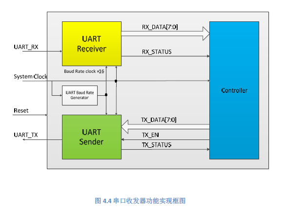
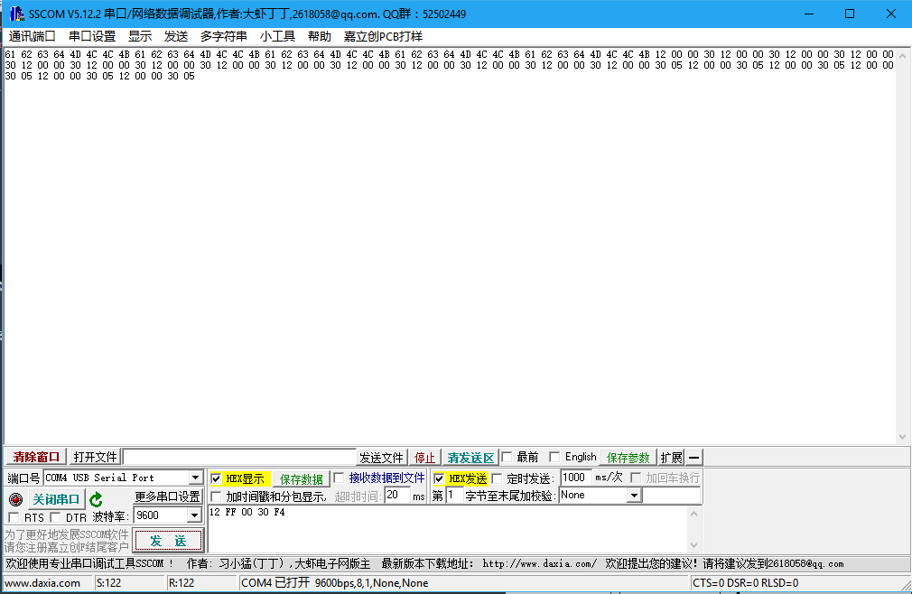

<h1 align = "center">实验四. 串口收发器设计实验报告</h1>
<h5 align = "center">无58 吴昆 2015010625</h5>

## 一、实验目的
1. 了解和掌握UART的工作原理

## 二、实验方案
### 1. 实验任务
1. 实现串口接收器的行为级设计，满足上述串口通信要求。
2. 实现串口发送器的行为级设计，满足上述串口通信要求。
3. 实现控制器，根据接收数据产生发送数据，规则如下：如果接收数据的MSB为‘1’，
则产生接收数据的反码作为发送数据；如果接收数据的MSB为‘0’，则直接将接
收数据的作为发送数据；
4. 将硬件平台的串口与计算机相连（USB接口），通过串口调试助手进行验证。

### 2. 系统结构
系统框图如图所示：
  
可以看到，系统由接收器、控制器、发送器以及波特率发生器四部分组成。  
### 3. 各组成部分与控制信号说明
波特率发送器产生9600*16Hz的方波周期信号，供接收器同步异步`UART_RX`输入信号，以及发送器产生正确比特率的串口信号。  
接收器的任务是，接收串口`UART_RX`发来的数据，接受完后`RX_DATA[7:0]`发送给控制器，同时产生`RX_STATUS`高电平脉冲。  
控制器的任务是，接收接收器由`RX_DATA[7:0]`发来的数据，将数据`TX_DATA[7:0]`发送给发送器。在发送数据同时，`TX_ENABLE`发送高电平脉冲。  
发送器的任务是，将控制器发给的`TX_DATA[7:0]`转换成串口信号输出，在空闲状态`TX_STATUS`置高电平，否则为低电平。
### 4. 串口信号约定
9600Hz，8bit数据位、1bit起始位、1bit停止位，无校验信号。

### 5. 代码细节和约定
根据助教的建议，在`always`块触发中不加入`rx_status`等控制信号，全部采用`sysclk`或者`baud`，一般来说需要采样输入信号或者控制输出信号频率的`always`块会用`baud`，其它`sysclk`。  
主要难点有两个，一个是控制信号的写法，比如`rx_status`信号，它的脉冲产生，高电平是由，低电平是在高电平进行了一段时间（实现中为2个`baud`周期）后转变；考虑到不能重驱动，需要精心布置各个`always`块控制的信号。  
实现中约定`rx_status`下降沿时`rx_data[7:0]`有效，`controller`存入该数据；`tx_en`下降沿时`tx_data[7:0]`有效，sender接受该数据并开始传输。这两个脉冲信号的脉宽均为2个`baud`周期。  
由于下降沿触发的信号时候通常为低电平，且`always`块触发均为`sysclk`和`baud`，因此不能简单地`if (~rx_status)`。实现中分别利用`rx_high`，`enabled`记录前一刻是否是高电平，如果前一刻高电平且现在低电平，那么就遇到了一个下降沿，由此触发控制器接收数据或者发送器开始发送。  
具体实现中，使用了中间变量。主要原因有：1.利用`rx_negedge`信号表示遇到`rx_status`下降沿，并在另一个时钟触发的`always`块中触发动作；2.利用`started`表示发送器开始发送，此时开始计数并发送数据，和`started`低电平接受`tx_en`和`tx_data`是两个不同的状态；3.`rx_negedge2`这样的变量来延长`rx_negedge`脉宽为2个`baud`周期，有点类似于状态机。  
脉冲的脉宽均为2个`baud`周期，原因在于下降沿全用“上一周期高电平加该周期低电平”判断，考虑到可能的时延，因此两个周期会保险一点。


## 三、代码
### 1. 管脚约束
constraint.xdc  
```
set_property IOSTANDARD LVCMOS33 [get_ports sysclk]
set_property IOSTANDARD LVCMOS33 [get_ports {txd}]
set_property IOSTANDARD LVCMOS33 [get_ports {rxd}]
set_property IOSTANDARD LVCMOS33 [get_ports {reset}]

set_property PACKAGE_PIN W5 [get_ports sysclk]
set_property PACKAGE_PIN B18 [get_ports {rxd}]
set_property PACKAGE_PIN A18 [get_ports {txd}]
set_property PACKAGE_PIN V17 [get_ports {reset}]

create_clock -period 10.000 -name CLK -waveform {0.000 5.000} [get_ports sysclk]
```
### 2. 各组成部分
component.v  
```verilog
module baud_rate_generation(baud,sysclk,reset);//16????
input sysclk,reset;
output reg baud;
reg [17:0] s;
initial begin 
s<=1;
baud<=0;
end
always @(posedge sysclk)
begin
if (reset)
begin
s<=1;
baud<=0;
end
s<=s+1;
if(s==18'd326)
baud<=~baud;
else if(s==18'd651)
baud<=~baud;
else if(s==18'd977)
baud<=~baud;
else if(s==18'd1302)
baud<=~baud;
else if(s==18'd1628)
baud<=~baud;
else if (s==18'd1953)
baud<=~baud;
else if(s==18'd2279)
baud<=~baud;
else if (s==18'd2604)
begin
baud<=~baud;
s<=1;
end
end
endmodule

module receiver(rx_data,rx_status,baud,rxd,reset);
output reg [7:0] rx_data;
reg [7:0] new_rx_data;
output reg rx_status;
input baud,rxd,reset;
reg started;
reg [7:0] count;

initial begin
started<=0;
rx_data<=8'b0;
new_rx_data<=8'b0;
rx_status<=0;
count<=0;
end

always @(posedge baud)
begin
if (reset)
begin
started<=0;
rx_data<=8'b0;
new_rx_data<=8'b0;
rx_status<=0;
count<=0;
end
else if (~rxd && ~started)
started<=1;//started为起始指示变量，当rxd发送起始位（低电平），且目前还未开始（started==0)，started变为1。在这个变量为1时接收器开始接收数据，计数器计数160个周期后started变为0。
if (started)
count<=count+1;
if (count==8'd160)
begin
count<=0;
started<=0;
end
//if (count==8'b8)//0 start bit
if (count==8'd24)//1
new_rx_data[0]<=rxd;//在一段数据的中间时间进行采样。
else if (count==8'd40)//2
new_rx_data[1]<=rxd;
else if (count==8'd56)//3
new_rx_data[2]<=rxd;
else if (count==8'd72)//4
new_rx_data[3]<=rxd;
else if (count==8'd88)//5
new_rx_data[4]<=rxd;
else if (count==8'd104)//6
new_rx_data[5]<=rxd;
else if (count==8'd120)//7
new_rx_data[6]<=rxd;
else if (count==8'd136)//8
new_rx_data[7]<=rxd;
else if (count==8'd152)//stop bit
begin
rx_data<=new_rx_data;
rx_status<=1;
end
else if (count==8'd154)
rx_status<=0;
end
endmodule

module controller(tx_data,tx_en,baud,tx_status,rx_status,rx_data,reset,sysclk);
input [7:0] rx_data;
reg [7:0] data;
reg ready,ready2,rx_high,rx_negedge,rx_negedge2;
input rx_status,tx_status,baud,sysclk;
input reset;
output reg tx_en;
output reg [7:0] tx_data;
initial begin
tx_en<=0;
tx_data<=8'b0;
data<=8'b0;
ready<=0;
ready2<=0;
rx_high<=0;
rx_negedge2<=0;
rx_negedge<=0;
end

always @(posedge baud)
begin
if (rx_status)
rx_high<=1;//rx_high为1说明此前rx_status为高电平，用来判断下降沿，以置位rx_negedge.
else if(rx_negedge2)
begin
rx_negedge2<=0;
rx_negedge<=0;//rx_negedge是rx_status下降沿指示信号，控制控制器接受接收器传来的数据。
end
else if(rx_negedge)
begin
rx_negedge2<=1;//rx_negedge2是为了rx_negedge高电平脉冲持续两个baud周期。
end
else if(~rx_status && rx_high)
begin
rx_negedge<=1;
rx_high<=0;
end
end

always @(posedge sysclk)
begin
if (rx_negedge)
begin
if (rx_data[7]==1)
data<=~rx_data;
else
data<=rx_data;
end
end

always @(posedge baud)
begin
if (reset)
begin
tx_en<=0;
tx_data<=8'b0;
end
if (ready && tx_status)//当有数据未发送，发送器就绪时准备发送
begin
tx_en<=1;
ready2<=1;//ready2为tx_en脉冲延续成2个baud周期
end
else if (ready2)
begin
ready2<=0;
ready<=0;
end
else if (~ready)
begin
tx_en<=0;//数据开始发送后，ready复位为低电平，tx_en脉冲结束
end
if (rx_negedge)
begin
ready<=1;//ready表示控制器目前有未发送的数据
tx_data<=data;//把信号放到tx_data，当发送器就绪并接收到tx_en脉冲就会接收并开始发送
end
end
endmodule

module sender(txd,tx_status,tx_en,tx_data,reset,baud,sysclk);
output reg txd;
output reg tx_status;
input tx_en,reset,baud,sysclk;
input [7:0] tx_data;
reg [7:0] data;
reg [7:0] count;
reg enabled,stop,started;
initial begin
txd<=1;
tx_status<=1;
enabled<=0;
stop<=0;
started<=0;
data<=8'b0;
count<=0;
end

always @(posedge sysclk)//tx_en or posedge stop)
begin
if (reset)
tx_status<=1;
else if (stop)
begin
tx_status<=1;//stop为1说明发送完成，tx_status为高电平，发送器空闲
end
else if (tx_en)
begin
tx_status<=0;//当收到tx_en脉冲，开始发送，同时发送器处于忙状态，tx_status低电平
end
end

always @(posedge baud)//sysclk ?baud???????baud?????
begin
if (reset)
begin
started<=0;
data<=8'b0;//tx_data;
end
else if (tx_en)
enabled<=1;//enabled
else if (~tx_en && enabled)//检测到tx_en下降沿
begin
enabled<=0;//enabled持续到tx_en转变为低电平
started<=1;//开始发送数据
data<=tx_data;//待发送信息从tx_data得到
end
if (baud)
begin
if (started)
begin
count<=count+1;
if (count==8'd160)
begin
stop<=1;
end
else if (count==8'd161)
begin
count<=0;//开始发送数据第161个baud周期停止
stop<=0;
started<=0;
end
if (count==8'd0)//0 start bit
txd<=0;
else if (count==8'd16)//1
txd<=data[0];
else if (count==8'd32)//2
txd<=data[1];
else if (count==8'd48)//3
txd<=data[2];
else if (count==8'd64)//4
txd<=data[3];
else if (count==8'd80)//5
txd<=data[4];
else if (count==8'd96)//6
txd<=data[5];
else if (count==8'd112)//7
txd<=data[6];
else if (count==8'd128)//8
txd<=data[7];
else if (count==8'd144)//stop bit
begin
txd<=1;
end
//else if (count==8'd159)
//stop<=1;
//else if (count==8'b153)
//rx_status<=0;
end
end
end
endmodule
```


### 3. 顶部文件
top_uart.v
```verilog
module uart(txd,rxd,sysclk,reset);
output txd;
input rxd;
input sysclk,reset;
wire [7:0] tx_data,rx_data;
baud_rate_generation baud_gen(.baud(baud),.sysclk(sysclk),.reset(reset));

receiver recv(.rx_data(rx_data),.rx_status(rx_status),.baud(baud),.rxd(rxd),.reset(reset));
controller cont(.tx_data(tx_data),.tx_en(tx_en),.baud(baud),.tx_status(tx_status),.rx_status(rx_status),.rx_data(rx_data),.reset(reset),.sysclk(sysclk));
sender send(.txd(txd),.tx_status(tx_status),.tx_en(tx_en),.tx_data(tx_data),.reset(reset),.baud(baud),.sysclk(sysclk));

endmodule
```

### 4. 测试文件
uart_tb.v
```verilog
`timescale 1ns/1ps
module baud_base(baud_base,baud);
input baud;
output reg baud_base;
reg [3:0] s;
initial begin
s<=0;
baud_base<=0;
end
always @(posedge baud)
begin
s<=s+1;
if (s==4'd15)
begin
baud_base<=~baud_base;
end

end
endmodule
module uart_test;
reg [4:0] inverse=5'b10011;
reg clk=0,reset=0,rx=1;
wire tx;
always 
begin
	#5 clk=~clk;
end

initial
begin
	#2000 inverse<=~inverse;
	reset<=1;
	#2400000 reset<=0;
	#1000 rx=0;
	#104166.667 rx=1;
	#104166.667 rx=0;
	#104166.667 rx=0;
	#104166.667 rx=1;
	#104166.667 rx=0;
	#104166.667 rx=1;
	#104166.667 rx=1;
	#104166.667 rx=1;
	#104166.667 rx=1;

	#104166.667 rx=0;
	#104166.667 rx=1;//0
	#104166.667 rx=0;//1
	#104166.667 rx=0;//2
	#104166.667 rx=1;//3
	#104166.667 rx=0;//4
	#104166.667 rx=1;//5
	#104166.667 rx=1;//6
	#104166.667 rx=1;//7
	#104166.667 rx=1;

	#104166.667 rx=0;
	#104166.667 rx=1;//0
	#104166.667 rx=0;//1
	#104166.667 rx=0;//2
	#104166.667 rx=1;//3
	#104166.667 rx=0;//4
	#104166.667 rx=1;//5
	#104166.667 rx=1;//6
	#104166.667 rx=1;//7
	#104166.667 rx=1;

	#2400000
	#104166.667 rx=0;
	#104166.667 rx=1;//0
	#104166.667 rx=0;//1
	#104166.667 rx=0;//2
	#104166.667 rx=1;//3
	#104166.667 rx=0;//4
	#104166.667 rx=1;//5
	#104166.667 rx=1;//6
	#104166.667 rx=1;//7
	#104166.667 rx=1;
	#2400000
	$stop;
end
baud_rate_generation baud_gen(.baud(baud),.sysclk(clk),.reset(reset));

baud_base bd_base(.baud_base(baud_base),.baud(baud));
uart uart
(
  .txd(tx),
  .rxd(rx),
  .sysclk(clk),
  .reset(reset)
);
endmodule
```
## 四、仿真结果及分析
### 1. 测试代码思路
产生了4个8bit数据，前3个连续一组，最后一个一组；通过看输出`tx`是否满足题意（MSB为0与`rx`相同，否则取非）。第一组为了测试连续输入时信号是否会出现紊乱、时序错误、后面的数据无法发出等问题。第二组是为了测试在第一组发送出去后等待一段时间以后还能正常收发数据，也就是系统还原成初始状态，没有“死机”。  
baud_base产生4800Hz信号，因此每一个发送bit对应baud半个周期，用这个办法我们可以在连续高电平或者低电平时对齐一格一格判断到底其中有多少位。  
`inverse`是为了测试verilog中`~`对宽度大于1的变量是否是按位非的。  

### 2. 仿真结果
仿真结果如下图所示：  
  
可以看到，uart将MSB为0的`rx`输入信号原样由`tx`输出，MSB为1时取非输出，数据位正确，起始位、停止位都存在。  
当然，也对各组件的中间变量进行了仿真，发现都符合预期设想，且在发送完后复原到了初状态。由于信号众多没有截图完整，以下图作示意：  
  
此外，还测试了当`reset`为高电平时，内部状态是否恢复成初始状态，以及胡乱的输出；本来是有00 00 00 ……输出的，但后来修正了这个错误。

### 3. 板上测试
烧上板子测试，设置波特率9600，8数据位，1停止位，无校验位，取消RTX，DTR。发现输入一个或多个8bit数据，都能相应返回正确的结果，测试通过。  


## 五、时序综合
  
  
查看utilization，我们发现，接收器、波特率发生器、发生器都是用了比较多的LUT，原因在于这三个组件中都需要做很多相等判断。  
  
各组件都用了很多的Register as Flip Flop，存储数据、中间变量等都算作这一类，因此是比较正常的。`baud`使用18位存储内部计数`s[17:0]`，这是因为之前计算出错用了比较大的数，其实13位就够了，可以节省5个。  

## 六、实验结论
1. 通过这个实验我对UART协议有了进一步的了解。这是继频率计之后第二个比较复杂的、包括多个组件的系统的实验，进一步增强了阅读系统框图和实现整个系统的能力。
2. 在debug的时候，按照先仿真、再板上测试的办法；遇到了一些主要的bug：1. 信号悬空，这是由于顶部文件调用组件漏掉输入信号、输入信号变量名写错、增加组件输入信号所致；2. 组件输出信号或中间变量没有达到预期，波形非常奇怪或者常高/低点评，由于中间变量和控制信号控制了各个组件的运转，这些信号的写错会导致组件工作失常，进而导致其它信号的波形都非常怪异。在遇到这种情况时，要找到问题的根源，因为很多信号的错误可能是其依赖的控制信号出错，而真正有问题的是产生那些控制信号的代码。通常都是`always`或者`if`块写错导致的。
3. 这个实验中信号比较多且复杂，需要仔细阅读实验指导书知道各个控制信号的意义；而且控制信号的上升还是下降沿触发动作，数据位完还是停止位完发送，脉宽多少都是需要自己设计的；在实现时由于重驱动是不允许的，需要精心规划不同的`always`块控制的信号；对于下降沿如何处理也是比较复杂的问题等等。因此，这个实验培养了对整个UART系统的了解以及设计复杂系统中各组件信号传递和触发的能力，是非常引人入胜也很有收获的。
4. 与助教沟通过一次，他指出了我使用控制信号下降沿触发`always`块的不合理之处，这种规范的学习对于培养硬件描述语言的良好习惯非常重要。毕竟`HDL`不仅是一门软件语言也涉及到硬件的具体实现，要对硬件足够了解才能写出良好的代码。感谢老师和助教四次实验以来的支持和教导！