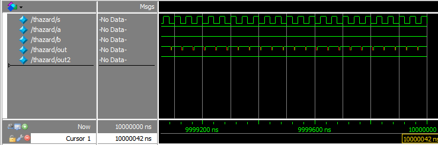
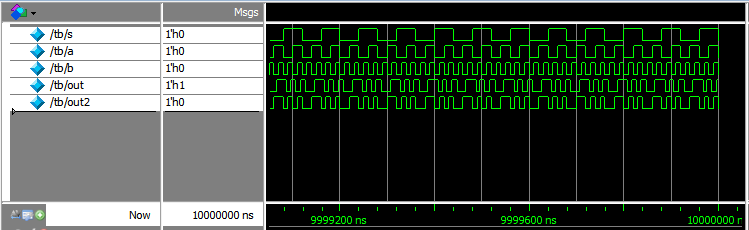
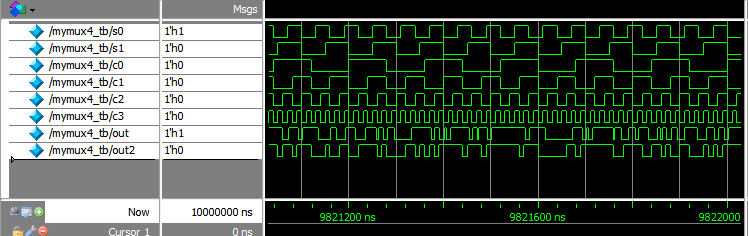
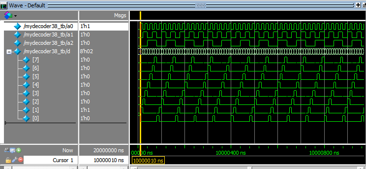
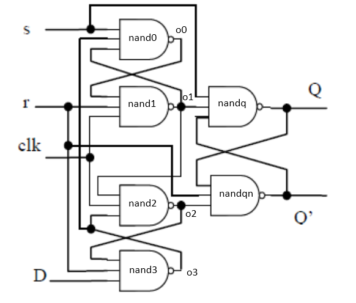
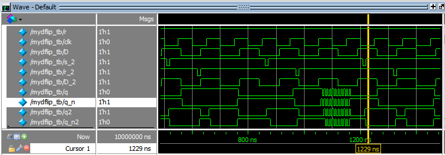
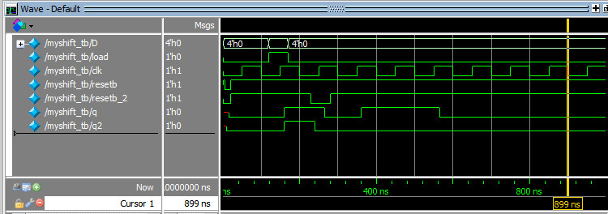

<h1 align = "center">第一次实验报告</h1>
<center>无58 吴昆 2015010625</center>
## 第一题多路选择器
### 1. 二选一多路选择器分析

### 2. 二选一多路选择器代码
mux2.v里定义了带延时mymux2和不带延时mymux2_nd的二选一多路选择器模块。  
mux2_testbench.v是测试代码，测试(s,a,b)各种组合下的输出是否和逻辑表达式`y=~s*a+s*b`一致，采用`always @(*)`在输入变化时立即和无延时模组的输出进行比较，如果错误输出wrong。

```verilog
`timescale 1ns/1ns;
module mymux2(out,s,a,b);
	input a,b,s;
	output out;
	not #3 (s_n,s);
	and #3 (sb,s,b);
	and #3 (sna,s_n,a);
	and #5 (ab,a,b);
	or #3 (out,sb,sna,ab);
endmodule

module mymux2_nd(out,s,a,b);
	input a,b,s;
	output out;
	not (s_n,s);
	and (sb,s,b);
	and (sna,s_n,a);
	and (ab,a,b);
	or (out,sb,sna,ab);
endmodule
```
mux2_testbench.v
```verilog
include mux2.v;
`timescale 1 ns / 1 ns
module thazard;
	reg s,a,b;
	mymux2 mx2(.out(out),.s(s),.a(a),.b(b));
	mymux2_nd mx2_nd(.out(out2),.s(s),.a(a),.b(b));
	initial begin
		s<=0;
		a<=1;
		b<=1;
	end
	initial begin
		forever #20 s<=~s;
	end
	always @(*) begin
		if(out2!=(~s)*a+s*b)
			$display("wrong");
		//else $display("right");
	end
endmodule

module tb;
	reg s,a,b;
	mymux2 mx2(.out(out),.s(s),.a(a),.b(b));
	mymux2_nd mx2_nd(.out(out2),.s(s),.a(a),.b(b));
	initial begin
		s<=0;
		a<=0;
		b<=0;
	end
	initial fork
		forever #40 s<=~s;
		forever #20 a<=~a;
		forever #10 b<=~b;
	join
	always @(*) begin
		if(out2!=(~s)*a+s*b)
			$display("wrong");
		//else $display("right");
	end
endmodule
```

### 3. 竞争冒险消除
分析中提到，不加入ab项时在(s,a,b)=(0,1,1)和(s,a,b)=(1,1,1)间转换会产生毛刺，如下图所示，红色表示输出不确定。竞争冒险现象仅在模块中逻辑门有延时时会发生。  
  
加入ab项后我们再看，毛刺已经消除。  
  

### 4. 逻辑真值测试

运行`Run 100`并没有输出wrong，由上述知逻辑输出是正确的，同时延时模块输出out和无延时模块输出out2波形一致，在时间上有延迟，因此模块逻辑是符合给出的逻辑表达式的。

### 5. 四选一多路选择器的设计
四选一多路选择器可以由三个二选一多路选择器实现，按照题目给出的要求，设计如图  
==插入图片==

### 6. 四选一多路选择器代码
mux.v里分别定义了四选一多路选择器mymux4模块和testbench，和上述类似，定义了无延时模块mymux4_nd将其输出与逻辑表达式`(~s0)*(~s1)*c0+s0*(~s1)*c1+(~s0)*s1*c2+s0*s1*c3`进行比较
```verilog
include mux2.v;
module mymux4(out,s0,s1,c0,c1,c2,c3);
	output out;
	input s0,s1,c0,c1,c2,c3;
	mymux2 mx2_0(.out(o0),.s(s0),.a(c0),.b(c1));
	mymux2 mx2_1(.out(o1),.s(s0),.a(c2),.b(c3));
	mymux2 mx2_2(.out(out),.s(s1),.a(o0),.b(o1));
endmodule

module mymux4_nd(out,s0,s1,c0,c1,c2,c3);
	output out;
	input s0,s1,c0,c1,c2,c3;
	mymux2_nd mx2_0(.out(o0),.s(s0),.a(c0),.b(c1));
	mymux2_nd mx2_1(.out(o1),.s(s0),.a(c2),.b(c3));
	mymux2_nd mx2_2(.out(out),.s(s1),.a(o0),.b(o1));
endmodule

module mymux4_tb;
	reg s0,s1,c0,c1,c2,c3;
	mymux4 mx4(out,s0,s1,c0,c1,c2,c3);
	mymux4_nd mx4_nd(out2,s0,s1,c0,c1,c2,c3);
	initial begin
		s0<=0;
		s1<=0;
		c0<=0;
		c1<=0;
		c2<=0;
		c3<=0;
	end
	initial fork
		forever #50 s1<=~s1;
		forever #30 s0<=~s0;
		forever #80 c0<=~c0;
		forever #40 c1<=~c1;
		forever #20 c2<=~c2;
		forever #10 c3<=~c3;
	join
	always @(*) begin
		if(out2!=(~s0)*(~s1)*c0+s0*(~s1)*c1+(~s0)*s1*c2+s0*s1*c3)
			$display("wrong");
		//else $display("right");
	end
endmodule
```
### 7. 四选一多路选择器测试
执行`Run 100`，波形如图，没有输出wrong。说明结果正确。    


## 第二题三八译码器
### 1. 分析
由真值表输入a2,a1,a0的8个最小项和输出d7-d0一一对应，也就是说当在某一个状态时有且只有一个di输出为1，而di在其他状态下输出都为0。使用或与形式来构建电路，每个输出对应一个三输入与门，卡诺图不需要化简，由于电路简单且共8个输出，这里省去了卡诺图和电路图。
### 2. 代码
decoder.v包含了三八译码器mydecoder38模块定义和testbench。
decoder.v
```verilog
module mydecoder38(d,a2,a1,a0);
	output [7:0] d;
	input a2,a1,a0;
	not(a2_n,a2);
	not(a1_n,a1);
	not(a0_n,a0);
	and(d[7],a2,a1,a0);
	and(d[6],a2,a1,a0_n);
	and(d[5],a2,a1_n,a0);
	and(d[4],a2,a1_n,a0_n);
	and(d[3],a2_n,a1,a0);
	and(d[2],a2_n,a1,a0_n);
	and(d[1],a2_n,a1_n,a0);
	and(d[0],a2_n,a1_n,a0_n);
endmodule

module mydecoder38_tb;
	reg a0,a1,a2;
	wire [7:0] d;
	mydecoder38 dcder38(.d(d),.a2(a2),.a1(a1),.a0(a0));
	initial begin
		a0<=0;
		a1<=0;
		a2<=0;
	end
	initial fork
		forever #10 a0<=~a0;
		forever #20 a1<=~a1;
		forever #40 a2<=~a2;
	join
endmodule
```
### 3. 测试结果



## 第三题D触发器

### 1. 异步重置和置位的D触发器设计
题目旁边的图给出的D触发器就是满足设计要求的电路，我们看到当S（严格意义应该称作S非信号）为低电平时nandq输出Q高电平，因此实现的是S低电平置位功能；类似地，R为低电平时D触发器重置。  
这个电路是一个上升沿的D触发器，同时满足异步重置和置位要求。  


### 2. D触发器代码
我们给出d_flip.v代码，包含了模块的定义和testbench。  
d_flip.v
```verilog
`timescale 1ns/1ns
module mydflip(q,q_n,s,r,clk,D);
	output q,q_n;
	input s,r,clk,D;
	wire o0,o1,o2,o3;
	nand #5 nand0(o0,s,o3,o1);
	nand #5 nand1(o1,o0,r,clk);
	nand #5 nand2(o2,o1,clk,o3);
	nand #5 nand3(o3,o2,r,D);
	nand #5 nandq(q,q_n,o1,s);
	nand #5 nandqn(q_n,q,r,o2);
endmodule

module mydflip_tb;
	reg s,r,clk,D;
	reg s_2,r_2,D_2;
	mydflip dflp(.q(q),.q_n(q_n),.s(s),.r(r),.clk(clk),.D(D));
	mydflip dflp2(.q(q2),.q_n(q_n2),.s(s_2),.r(r_2),.clk(clk),.D(D_2));
	initial begin
		D<=0;D_2<=0;
		s<=1;s_2<=1;
		r<=1;r_2<=1;
		clk<=0;
	end
	initial fork
		forever #50 clk<=~clk;
		forever #70 D<=~D;
		forever #70 D_2<=~D_2;
	join
	initial fork
		forever begin
			#160 s_2<=0; #10 s_2<=1; #180;
		end
		forever begin
			#270 r_2<=0; #10 r_2<=1; #70;
		end
	join
endmodule
```

### 3.D触发器测试
  
我们在testbench中放了两个d触发器模块，分别对应输入为`s,r,clk,D`;`s_2,r_2,clk,D_2`;输出为`q,q_n`和`q2,q_n2`。其中`D`和`D_2`的初始值和变化是一样的。我们用第一个模块测试D是否在上升沿正确传递到Q，及相反电平信号传递到Q_n；用第二个模块来测试异步置位、重置功能。  
看q和q_n我们看到，在clk上升沿，D的电平和反电平准确传输到了q和q_n，二者始终保持相反的电平。  
检查q2和q_n2我们看到，当`s_2`或`r_2`被置为0时，`q2`和`q_n2`会相应地置为对应功能要求的电平，这个变化与时钟无关，是异步的，而且`q2,q_n2`保持相反的电平。  
我们设置每个基本门的延时是5ns，在仿真中我们看到一处输出电平值不确定，图中这个例子是由于D信号在保持时间内发生变化所致。

### 4.移位寄存器代码
按照作业要求最后一页给出的图，实现了shift.v，同上述代码包含testbench。  
shift.v  
```verilog
include mux2.v;//mux2(out,s,a,b)
include d_flip.v;//mydflip(q,q_n,s,r,clk,D)
module myshift(q,D,load,clk,resetb);
	output q;
	input [3:0] D;
	input load,clk,resetb;
	supply1 s;
	mydflip dflp0(.q(q0),.q_n(q0_n),.s(s),.r(resetb),.clk(clk),.D(D[0]));
	mymux2 mx0(.out(d_in1),.s(load),.a(q0),.b(D[1]));
	mydflip dflp1(.q(q1),.q_n(q1_n),.s(s),.r(resetb),.clk(clk),.D(d_in1));
	mymux2 mx1(.out(d_in2),.s(load),.a(q1),.b(D[2]));	
	mydflip dflp2(.q(q2),.q_n(q2_n),.s(s),.r(resetb),.clk(clk),.D(d_in2));
	mymux2 mx2(.out(d_in3),.s(load),.a(q2),.b(D[3]));
	mydflip dflp3(.q(q),.q_n(q3_n),.s(s),.r(resetb),.clk(clk),.D(d_in3));
endmodule

module myshift_tb;
	reg [3:0] D;
	reg load,clk,resetb,resetb_2;
	myshift msft(.q(q),.D(D),.load(load),.clk(clk),.resetb(resetb));
	myshift msft2(.q(q2),.D(D),.load(load),.clk(clk),.resetb(resetb_2));
	initial begin
		D<= 4'b1011;
		clk<=0;
		load<=0;
		resetb<=1;
		resetb_2<=1;
		#120 load<=1; #50 load<=0;D<=4'b0000;
	end
	initial fork
		#5 resetb<=0;resetb_2<=0;#20 resetb<=1;#20 resetb_2=1;
		forever #50 clk<=~clk;
	join
	initial begin
		#230 resetb_2<=0; 
		#50 resetb_2<=1;
	end
endmodule;
```
###5.移位寄存器测试
  
定义了两个移位寄存器，其他输入均相同，仅`RESETB`输入独立，输出分别为`q`和`q2`。  
最开始需要对移位寄存器进行复位，复位方法是`RESETB(AR)`置低电平，这样电路的中间输入输出和最终输出才有确定值，然后是载入,`LOAD`置高电平同时D输入数据。由于`LOAD`是对异步二选一多路选择器操作，最后必须在`LOAD`置为低电平前传入D触发器，因此`LOAD`高电平应该在时钟上升沿前后，并满足建立时间和保持时间的约束。  
q2是测试`RESETB`，我们看到当在时钟上升沿使用复位，即`resetb_2`置低电平，我们看到`q2`此后输出恒为低电平，说明完成了内部状态的初始化。和`LOAD`一样，必须在时钟上升沿使用，且满足建立时间和保持时间的约束。  
